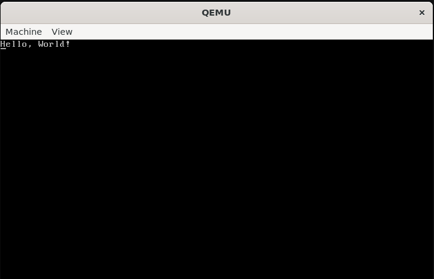

## MinOS

MinOS is the absolute simplest implementation of an operating system kernel that just prints out "Hello, World!", written in x86 assembly, using GRUB as the bootloader. The kernel source code is in `kernel.asm`, and there are also utilities to build an ISO to boot from.

### Boot

In `./build`, there is an ISO you can use to boot MinOS. You can either burn it onto an USB or a CD and plug it into a machine to boot, or just use QEMU to test:
```sh
qemu-system-x86_64 -cdrom ./build/minos.iso
```

It should look something like this:



If you want to build the ISO yourself from source, read the [Build](#build) section below.

### Build

Install necessary packages first:
```sh
sudo apt update
sudo apt install nasm qemu-system-x86 grub-common grub-pc-bin xorriso
```

Build binary:
```sh
nasm -f elf32 kernel.asm -o kernel.o
ld -m elf_i386 -T linker.ld -o kernel.bin kernel.o
```

Build a bootable ISO:
```sh
mv kernel.bin ./iso/boot/
grub-mkrescue iso -o minos.iso
```

Finally, you can take this iso and boot it, to test, we can use qemu:
```sh
qemu-system-x86_64 -cdrom minos.iso
```
